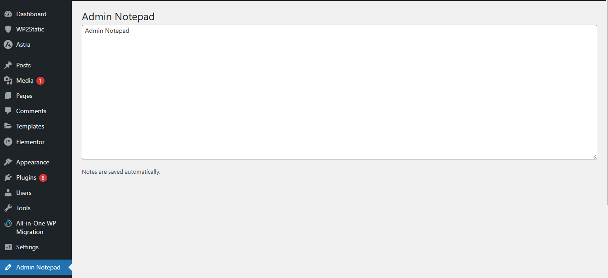

# Admin Notepad - WordPress Plugin

A simple **Admin Notepad Plugin** for WordPress. It **auto-saves** notes while typing and provides a **dashboard widget**.

## Features

✅ Auto-save notes while typing  
✅ Dashboard widget for quick access  
✅ Simple, clean, and lightweight

## Installation

1. Upload `admin-notepad` to `/wp-content/plugins/`
2. Activate the plugin in **WordPress > Plugins**.
3. Find **"Admin Notepad"** in the Admin Menu or Dashboard.

## License

This plugin is released under the **GPL-2.0 License**.
